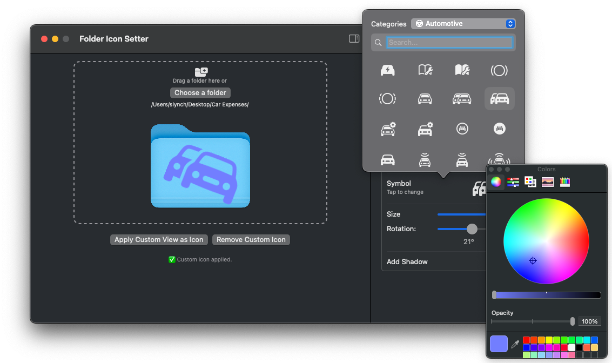
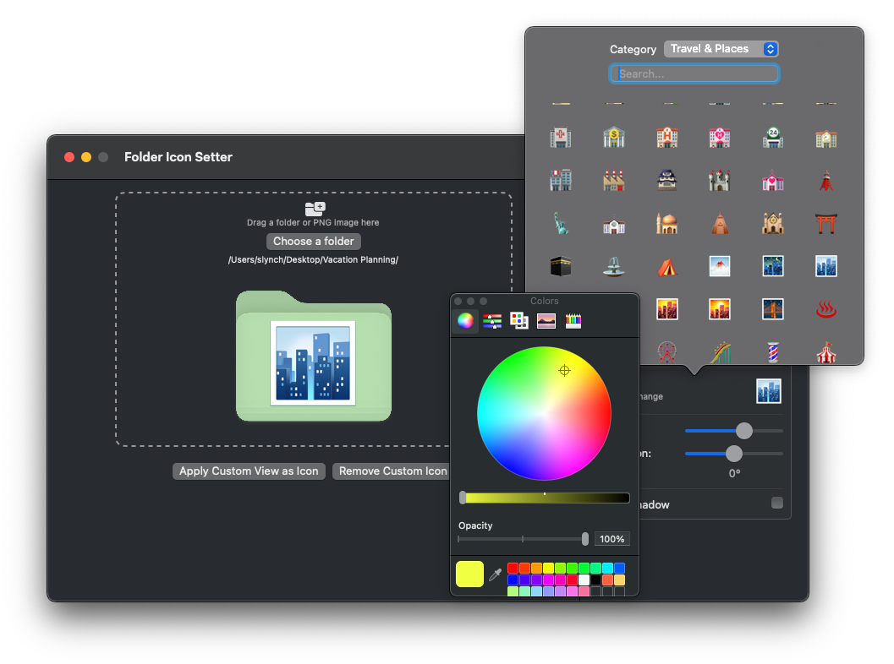

# **📁 Folder Flair**

**Folder Flair** is a macOS app that lets you customize your Finder folder icons with style, including colors, emojis, images, and over 6,000 SF Symbols.

This app was very much a “vibe-coded” project. It was developed with help from ChatGPT, but all design decisions and refinements were made by me. I’m sharing the source code for anyone who wants to build the app, customize it, or simply explore how it works.

I am not looking for feedback or comments on the coding style.  If you want, you can fork the branch and make your own enhancements and changes.

> ⚠️ Note: macOS 26 introduces native folder customization that will overlap with some of Folder Flair’s features. However, this app still offers options that macOS does not, such as support for custom images, scaling, and rotation.

> Keep in mind that if a Folder Flair icon is applied, macOS 26 disables the folder’s opening animation when dragging in content. Tagging support remains unchanged.
> If you build the app with Xcode 26, the application will recognize the version of macOS and use the correct base folder icon.

If you prefer not to build the app yourself, you can download the installer below.

## 🚀 Download Folder Flair Installer
 

## Features

### **🎨 Folder Tinting**

### **🖼 Icon Overlay Options**

You can add an overlay icon on top of the folder using one of three options:

- Choose from over 6,000 searchable **SF Symbols**
- Browse more than 1,800 categorized **emojis**
- Use a **custom PNG image** from your own files

Each overlay icon can be:

- Scaled
- Rotated
- Moved anywhere on the folder
- Colored (only for SF Symbols)

1. Choose from over 6000 categorized and searchable **SFSymbols**
   

2. Choose from over 1800 categorized and searchable **emojis**
   

3. Drag and drop, or choose your own custom  **image**

## **🛠 Instructions**

### **1. Select a Folder**

Either drag and drop a folder onto the dotted rectangle, or click the **Choose a Folder** button.

### **2. Apply a Tint (Optional)**

To change the folder color, make sure the **Tint Folder** checkbox is selected.

Then click the color square to choose a tint color.

### **3. Choose an Icon Type**

You can choose from:  

- SF Symbol
- Emoji
- PNG Image

(If the checkbox for the selected icon type is not enabled, no icon will be applied. The folder tint will still be used if selected.)

#### **Icon Color (SF Symbols Only)**

Click the **Symbol Color** square to apply a color to the SF Symbol.

#### **Icon Size**

Use the **Size** slider to scale the icon up or down.

#### **Icon Rotation**

Use the **Rotation** slider to rotate the icon.

### **4. Use a Custom PNG Image**

If you selected the PNG Image option, you can either drag and drop a PNG into the image area, or click the **Choose a PNG Image** button.

------

## **✅ Apply the Custom Icon**

Once you’ve chosen your folder, applied a tint, and selected an icon type, click **Apply Custom View as Icon** to update the folder.

## **♻️ Remove a Custom Icon**

To restore a folder to its default appearance, drag and drop it into the dotted area or use the **Choose a Folder** button. Then click **Remove Custom Icon**.

